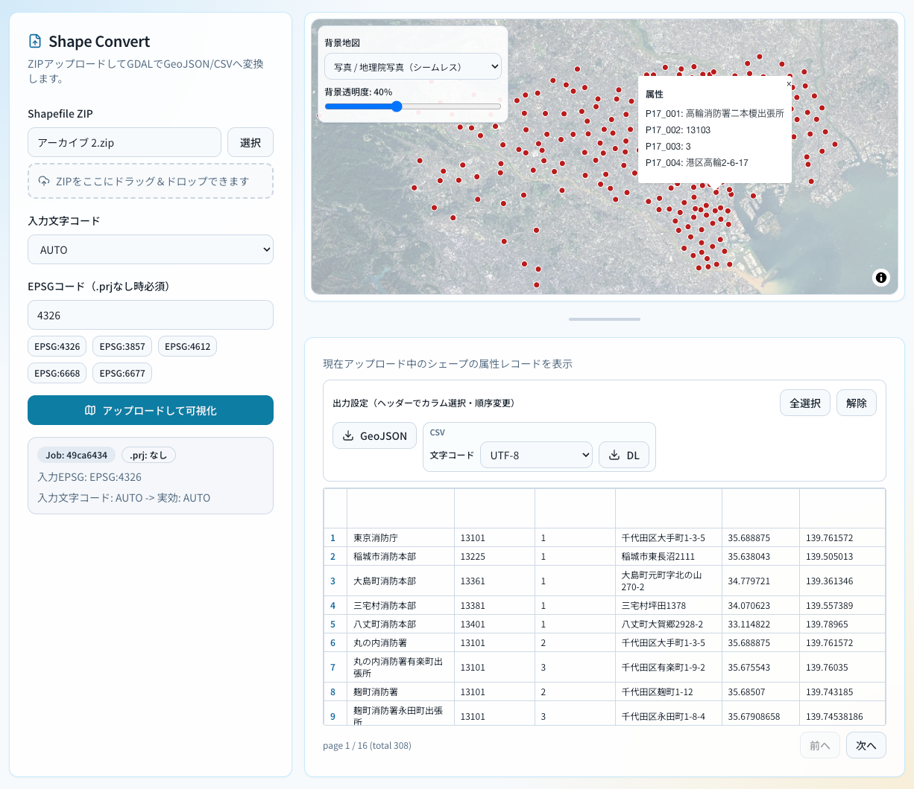

# shape-convert-web

## Overview
Shapefile ZIPをアップロードし、GDAL（ogr2ogr）でGeoJSON/CSVへ変換して可視化・ダウンロードするWebアプリです。

## 利用イメージ


## ローカル動作手順

### 1. 前提
- Docker Desktop が起動していること
- `docker compose` が使えること

### 2. 起動
```bash
docker compose up --build -d
```

### 3. アクセス
- Frontend: http://localhost:5173
- API Health: http://localhost:8080/health

### 4. 使い方
1. 画面で Shapefile の ZIP を選択
2. 必要に応じて入力文字コードを指定
3. `.prj` が無い ZIP の場合は EPSG コードを入力
4. `アップロードして可視化` を実行
5. CSV出力カラムを選択し、必要なら順序を並び替え
6. CSV文字コード（UTF-8 / UTF-8 BOM / CP932）を選択
7. 地図プレビュー確認後、GeoJSON/CSV をダウンロード
8. 地図下で現在アップロード中シェープのレコード一覧を確認（ページング）

### 5. 停止
```bash
docker compose down
```

### 6. 再ビルドして起動
```bash
docker compose up --build -d
```

### 7. ログ確認（問題がある場合）
```bash
docker compose logs -f frontend
docker compose logs -f api
```

## 実装済み要件
- Dockerで `frontend` / `api` 起動
- MapLibreでGeoJSONプレビュー表示（複数ベースマップ選択）
- `/api/upload` でZIP受信、Shapefile検証（`.shp/.shx/.dbf`）
- GDAL変換（GeoJSON/CSV）
- `.prj` がない場合はEPSG指定必須
- 入力文字コード指定（`inputEncoding`）対応（`.cpg` がある場合はAUTO時に`.cpg`を優先）
- CSV出力時のカラム選択/並び順指定
- CSV出力文字コード指定（`utf8`/`utf8bom`/`cp932`）
- ポイント系データのCSV出力時は `latitude` / `longitude` カラムを選択可能
- 現在アップロード中シェープのレコード一覧表示（ページング）
- アップロードジョブは1週間後に自動削除

## API
### `POST /api/upload`
multipart/form-data
- `file`: `.zip` (required)
- `inputEncoding`: `AUTO` / `UTF-8` / `CP932` ... (optional)
- `sourceEpsg`: `.prj` がない場合に必須（例: `4326`）

### `GET /api/jobs/:jobId/preview`
変換済みGeoJSONを返却

### `GET /api/jobs/:jobId/download.geojson`
GeoJSONダウンロード

### `GET /api/jobs/:jobId/download.csv`
CSVダウンロード
- `encoding`: `utf8` / `utf8bom` / `cp932`（省略時 `utf8`）
- `columns`: カンマ区切りで出力カラム順を指定（省略時は全カラム）

### `GET /api/jobs/:jobId/records`
現在ジョブのレコード一覧（ページング）
- `page`: 1始まりのページ番号（省略時 1）
- `pageSize`: 1ページ件数（省略時 20、最大200）
